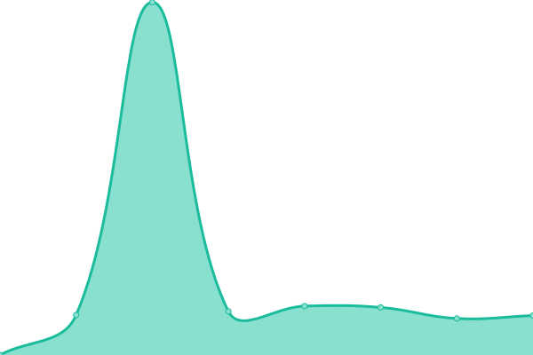
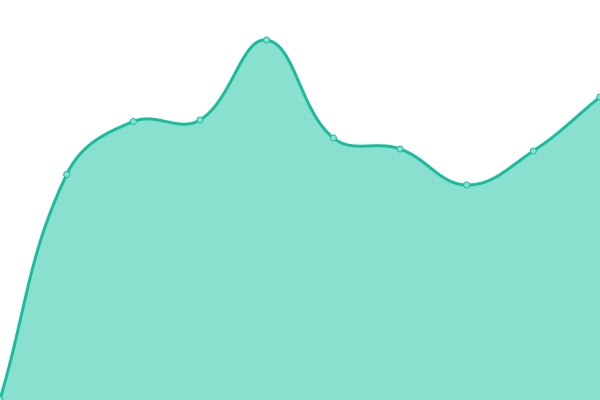

# [📈 Live Status](https://status.chd-tv.tk): <!--live status--> **🟥 Complete outage**

This repository contains the open-source uptime monitor and status page for [chdtv](https://status.chd-tv.tk), powered by [Upptime](https://github.com/upptime/upptime).

With [Upptime](https://upptime.js.org), you can get your own unlimited and free uptime monitor and status page, powered entirely by a GitHub repository. We use [Issues](https://github.com/chdtv/uptime/issues) as incident reports, [Actions](https://github.com/chdtv/uptime/actions) as uptime monitors, and [Pages](https://status.chd-tv.tk) for the status page.

<!--start: status pages-->
<!-- This summary is generated by Upptime (https://github.com/upptime/upptime) -->
<!-- Do not edit this manually, your changes will be overwritten -->
<!-- prettier-ignore -->
| URL | Status | History | Response Time | Uptime |
| --- | ------ | ------- | ------------- | ------ |
|  [Server 1](https://stream1.chd-servers.ml/) | 🟥 Down | [server-1.yml](https://github.com/chdtv/uptime/commits/HEAD/history/server-1.yml) | 

 0ms
     
 | 

<a href="https://status.chd-tv.tk/history/server-1">0.00%</a>
    

|  [Dynamic server (archive)](https://stream2-dynamic.chd-servers.ml/) | 🟥 Down | [dynamic-server-archive.yml](https://github.com/chdtv/uptime/commits/HEAD/history/dynamic-server-archive.yml) | 

 0ms
     
 | 

<a href="https://status.chd-tv.tk/history/dynamic-server-archive">0.00%</a>
    

|  [Server 2](https://stream2.chd-servers.ml/) | 🟥 Down | [server-2.yml](https://github.com/chdtv/uptime/commits/HEAD/history/server-2.yml) | 

 0ms
     
 | 

<a href="https://status.chd-tv.tk/history/server-2">0.00%</a>
    

|  [Server 3](https://stream3.chd-servers.ml/) | 🟥 Down | [server-3.yml](https://github.com/chdtv/uptime/commits/HEAD/history/server-3.yml) | 

 0ms
     
 | 

<a href="https://status.chd-tv.tk/history/server-3">0.00%</a>
    

|  [Server 4](https://stream4-ru.chd-servers.ml/) | 🟥 Down | [server-4.yml](https://github.com/chdtv/uptime/commits/HEAD/history/server-4.yml) | 

 0ms
     
 | 

<a href="https://status.chd-tv.tk/history/server-4">0.00%</a>
    

|  [Server 5](https://stream8.chd-servers.ml/) | 🟥 Down | [server-5.yml](https://github.com/chdtv/uptime/commits/HEAD/history/server-5.yml) | 

 0ms
     
 | 

<a href="https://status.chd-tv.tk/history/server-5">0.00%</a>
    

<!--end: status pages-->

[**Visit our status website →**](https://status.chd-tv.tk)

## 📄 License

- Powered by: [Upptime](https://github.com/upptime/upptime)
- Code: [MIT](./LICENSE) © [chdtv](https://status.chd-tv.tk)
- Data in the `./history` directory: [Open Database License](https://opendatacommons.org/licenses/odbl/1-0/)
