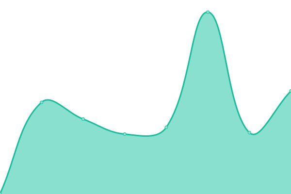
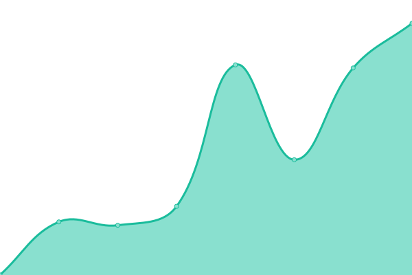

# [📈 Live Status](https://status.chd-tv.tk): <!--live status--> **🟩 All systems operational**

This repository contains the open-source uptime monitor and status page for [chdtv](https://status.chd-tv.tk), powered by [Upptime](https://github.com/upptime/upptime).

With [Upptime](https://upptime.js.org), you can get your own unlimited and free uptime monitor and status page, powered entirely by a GitHub repository. We use [Issues](https://github.com/chdtv/uptime/issues) as incident reports, [Actions](https://github.com/chdtv/uptime/actions) as uptime monitors, and [Pages](https://status.chd-tv.tk) for the status page.

<!--start: status pages-->
<!-- This summary is generated by Upptime (https://github.com/upptime/upptime) -->
<!-- Do not edit this manually, your changes will be overwritten -->
<!-- prettier-ignore -->
| URL | Status | History | Response Time | Uptime |
| --- | ------ | ------- | ------------- | ------ |
|  [Playlist](https://get.chd-tv.tk/playlist) | 🟩 Up | [playlist.yml](https://github.com/chdtv/uptime/commits/HEAD/history/playlist.yml) | 

 660ms
     
 | 

<a href="https://status.chd-tv.tk/history/playlist">100.00%</a>
    

|  [Server 1](https://stream1.servers.chd-tv.tk/) | 🟩 Up | [server-1.yml](https://github.com/chdtv/uptime/commits/HEAD/history/server-1.yml) | 

 861ms
     
 | 

<a href="https://status.chd-tv.tk/history/server-1">100.00%</a>
    

|  [Server 2](http://stream3.servers.chd-tv.tk/) | 🟩 Up | [server-2.yml](https://github.com/chdtv/uptime/commits/HEAD/history/server-2.yml) | 

 776ms
     
 | 

<a href="https://status.chd-tv.tk/history/server-2">57.40%</a>
    

|  [Server 3](https://stream6.servers.chd-tv.tk/) | 🟩 Up | [server-3.yml](https://github.com/chdtv/uptime/commits/HEAD/history/server-3.yml) | 

 900ms
     
 | 

<a href="https://status.chd-tv.tk/history/server-3">99.09%</a>
    

<!--end: status pages-->

[**Visit our status website →**](https://status.chd-tv.tk)

## 📄 License

- Powered by: [Upptime](https://github.com/upptime/upptime)
- Code: [MIT](./LICENSE) © [chdtv](https://status.chd-tv.tk)
- Data in the `./history` directory: [Open Database License](https://opendatacommons.org/licenses/odbl/1-0/)
